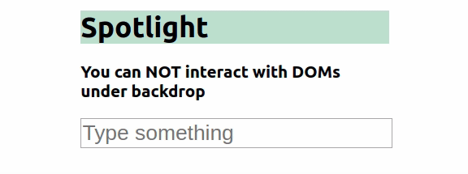

# rc-spotlight

> Spotlight component simply highlights the component(s) that it wraps.

[](https://www.npmjs.com/package/rc-spotlight) [](https://standardjs.com)

## Install

```bash
npm install --save rc-spotlight
```

## Demo



## Usage

```jsx
import React, { Component } from "react";

import Spotlight from "rc-spotlight";

class Example extends Component {
  render() {
    return (
      <Spotlight isActive renderOnBackdrop={<h1>This is backdrop view</h1>}>
        <div>Content with Spotlight Effect</div>
      </Spotlight>
    );
  }
}
```

## Properties

| Property         | Description                                                                    | Type         | Default                           |
| ---------------- | -------------------------------------------------------------------------------| ------------ | --------------------------------- |
| isActive         | Weather the component is enabled or disabled.                                  | Boolean      | false                             |
| children         | Component(s) to have spotlight effect                                          | Node(s)      | null                              |
| renderOnBackdrop | Component(s) to be rendered over backdrop.                                     | ReactNode(s) | null                              |
| backdropZIndex   | Z index of backdrop. It will override the css class style with inline style.   | Number       | null (css class style: "1000")    |
| backdropColor    | Color of backdrop. It will override the css class style with inline style.     | String       | null (css class style: "#000000") |
| backdropOpacity  | Opacity of backdrop. It will override the css class style with inline style    | Number       | null (css class style: 0.7)       |

## License

MIT © [kerematam](https://github.com/kerematam)
