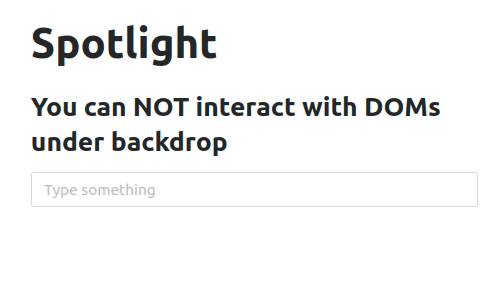

# rc-spotlight

> Spotlight component simply highlights the component(s) that it wraps.

[](https://www.npmjs.com/package/rc-spotlight)
[](https://standardjs.com)
[](https://conventionalcommits.org)

# Install

```bash
npm install --save rc-spotlight
```

# Demo


# Usage

```jsx
import React, { Component } from "react";
import Spotlight from "rc-spotlight";

class Example extends Component {
  render() {
    return (
      <Spotlight isActive renderLabel={<h1>This is backdrop view</h1>}>
        <div>Content with Spotlight Effect</div>
      </Spotlight>
    );
  }
}
```

## Usage with LabelWrapper

```jsx
import React from "react";
import Spotlight, { LabelWrapper } from "rc-spotlight";

const BackdropText = text => (
  <LabelWrapper center>
    <div>{text}</div>
  </LabelWrapper>
);

const App = () => (
  <Spotlight isActive renderLabel={BackdropText("This is title")}>
    <h1>Spotlight</h1>
  </Spotlight>
);
```

## Usage with Antd Tooltip



Create Wrapper for Spotlight with Tooltip :

```jsx
const SpotlightWithTooltip = ({
  isActive,
  toolTipPlacement = "top",
  toolTipTitle = "Check here!",
  children,
  ...rest
}) => {
  return (
    <Tooltip
      placement={toolTipPlacement}
      visible={isActive}
      title={toolTipTitle}
    >
      <Spotlight isActive={isActive} {...rest}>
        {children}
      </Spotlight>
    </Tooltip>
  );
};
```

And use it :

```jsx
const App = () => (
  <SpotlightWithTooltip
    isActive
    inheritParentBackgroundColor
    toolTipPlacement="right"
    toolTipTitle={"You can use Antd Tooltip"}
    style={{
      width: "fit-content",
      boxShadow: "0 0 0 5px #ffffff"
    }}
  >
    <Title>Spotlight</Title>
  </SpotlightWithTooltip>
);
```

## Spotlight API

<table>
  <thead>
    <tr>
      <th>Property</th>
      <th>Description</th>
      <th>Type</th>
      <th>Default</th>
    </tr>
  </thead>
  <tbody>
    <tr>
      <td>isActive</td>
      <td>Whether the component is enabled or disabled.</td>
      <td>Boolean</td>
      <td>false</td>
    </tr>
    <tr>
      <td>children</td>
      <td>Component(s) to have spotlight effect.</td>
      <td>Node(s)</td>
      <td>null</td>
    </tr>
    <tr>
      <td>renderLabel</td>
      <td>Function to return Component(s) to be rendered over backdrop.</td>
      <td>Function</td>
      <td>null</td>
    </tr>
    <tr>
      <td>zIndex</td>
      <td>Z index of backdrop and wrapped component.</td>
      <td>Number or String</td>
      <td>1000</td>
    </tr>
    <tr>
      <td>backdropColor</td>
      <td>Color of backdrop.</td>
      <td>String</td>
      <td>#000000</td>
    </tr>
    <tr>
      <td>backdropOpacity</td>
      <td>Opacity of backdrop.</td>
      <td>Number</td>
      <td>0.8</td>
    </tr>
    <tr>
      <td>inheritParentBackgroundColor</td>
      <td>Recursively search for parent background color in case you don't want your component to inherit color of
        backdrop. This is useful when your component is transparent and inherits backdrops color.</td>
      <td>Boolean</td>
      <td>false</td>
    </tr>
    <tr>
      <td>enableShadow</td>
      <td>Gives shadow around wrapped component .</td>
      <td>Boolean</td>
      <td>false</td>
    </tr>
    <tr>
      <td>style</td>
      <td>Inline style for wrapped component when spotlight is actived</td>
      <td>Object</td>
      <td>null</td>
    </tr>
  </tbody>
</table>

## LabelWrapper API

<table>
  <thead>
    <tr >
      <th>Property</th>
      <th>Description</th>
      <th>Type</th>
      <th>Default</th>
    </tr>
  </thead>
  <tbody>
    <tr>
      <td>children</td>
      <td>Component(s) to have spotlight effect.</td>
      <td>Node(s)</td>
      <td>null</td>
    </tr>
    <tr>
      <td>zIndex</td>
      <td>Z index of backdrop and wrapped component.</td>
      <td>Number or String</td>
      <td>1000</td>
    </tr>
    <tr>
      <td>center</td>
      <td>Centers label</td>
      <td>Boolean</td>
      <td>false</td>
    </tr>
    <tr>
      <td>style</td>
      <td>Inline style for label</td>
      <td>Object</td>
      <td>null</td>
    </tr>
  </tbody>
</table>

## License

MIT © [kerematam](https://github.com/kerematam)
